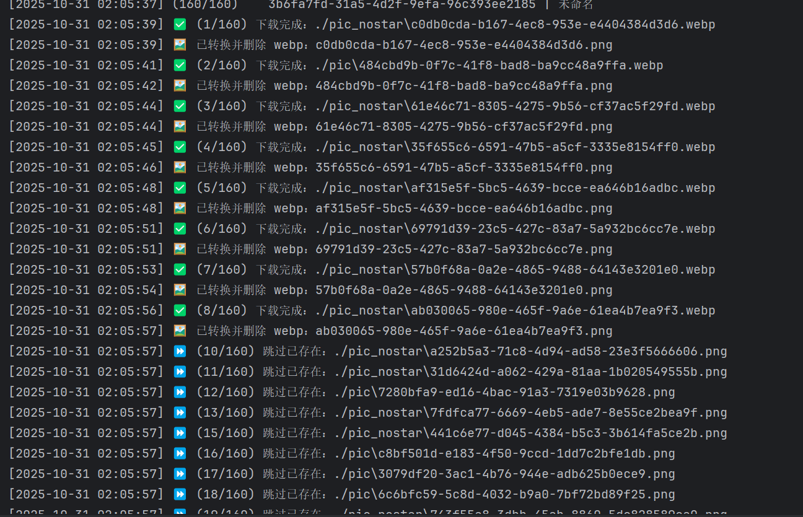

# 捏Ta辅助工具



一个用于捏Ta平台的辅助工具，支持以下功能：

- ✅ 下载无水印原图
- ✅ 自动每日签到
- ✅ 自动完成每日任务

> ⚠️ 当前项目仍处于开发阶段，功能可能不稳定，欢迎反馈与贡献！

---

## 🛠 安装与环境配置

建议使用 Python 虚拟环境来隔离依赖：

```bash
# 创建虚拟环境
python -m venv venv

# 激活虚拟环境
source venv/bin/activate      # macOS/Linux
venv\Scripts\activate         # Windows
```

```bash
安装依赖：

bash
pip install -r requirements.txt
```

---

## 🔐 配置 CK 信息
程序运行前，请在项目根目录下创建一个名为 token.txt 的文件，并将你的 CK 信息粘贴进去：

代码
ck信息内容（无需加引号）
📌 注意：请勿将包含敏感信息的 token.txt 文件提交到 GitHub。建议在 .gitignore 中添加以下内容：

代码
token.txt
---

## 🚀 快速开始

```bash
python main.py
```

---

## 📁 项目结构说明

├── main.py # 主程序入口  
├── test.py # 测试脚本  
├── token.txt # 存放 CK 信息（需用户自行创建）  
├── requirements.txt # 项目依赖列表  
├── pyproject.toml # Poetry 配置文件（可选）  
├── poetry.lock # Poetry 锁定依赖版本（可选）  
├── README.md # 项目说明文档  
├── nieta_auto.log # 日志文件（运行时生成）

---

## 🤝 贡献方式

欢迎提交 issue 或 pull request 来改进项目功能。你也可以 fork 本项目后自行开发。

---

## 📜 许可证

本项目采用 MIT License 开源协议，详情请见 LICENSE 文件。
